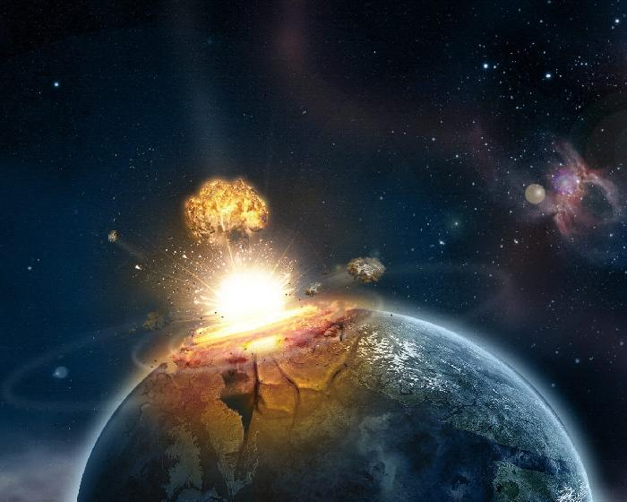

Did you feel these past two weeks like you were hit on the head with “a small body of matter from outer space that enters the earth’s atmosphere, becoming incandescent as a result of friction and appearing as a streak of light”?

If so, you’re probably not the only one. There is definitely an initial learning curve with Meteor. What did you find difficult? What did you find easy? What did you find cool and interesting?

# Meteor is hard! 

If you are looking at this header and you are thinking I have bad grammar than you need to do more reading on web apps. Do not worry though I am here to teach if you are willing to learn. Yes, meteors from space are hard, but the Meteor I am talking about is a web application platform. It allows programmers, like myself, to create interesting websites for all types of devices. So instead of just seeing a website on your desktop in regular form, Meteor can easily format a website for mobile devices! Also, Meteor allows us to change that website without disrupting the people using it. For programmers this concept is brilliant because it is faster and easier to implement than other web application platforms.

I still stick to my original statement that using Meteor is difficult, even if I just said it was easier to implement. Basically, it probably means that making websites with another framework will be even harder! Making the web pages were easy for me since I already knew how to use HTML and Semantic Ui, but actually making those pages work and interact with users was what created craters in my head.

## Luckily, craters are good!

There is a theory that states that Meteors are what helped create life on Earth. When Earth was young and developing, the meteors that crashed into it were made out of ice and helped formed oceans. They also brought other chemicals to this planet that eventually made life possible here on Earth. So just like celestial meteors, we have to take the beatings of Meteor in order for us to learn and grow as Web Developers. We have to get bombarded about information on servers, clients, routers, imports, templates, Mongo, etc. There are many more information we have to tackle but learning all of these while making a website is pretty difficult.
There is a theory that states that Meteors are what helped create life on Earth. When Earth was young and developing, the meteors that crashed into it were made out of ice and helped formed oceans. They also brought other chemicals to this planet that eventually made life possible here on Earth. So just like celestial meteors, we have to take the beatings of Meteor in order for us to learn and grow as Web Developers. We have to get bombarded about information on servers, clients, routers, imports, templates, Mongo, etc. There are many more information we have to tackle but learning all of these while making a website is pretty difficult.

## Sometimes, meteors are deadly.
So during my process of understanding meteor, I came across situations that were difficult to overcome. First of all, setting up meteor is a pain. It takes forever to build a local website but Meteor is trying to improve the build time. I believe once you have an idea and you are ready to start making a website, we should be able to go in fully swinging. However, when using Meteor I am stuck waiting for it to build as my momentum starts to fade. Secondly, there were also times where I spent hours trying to figure out why I am getting errors. I learned that it was difficult to find a solution when I do not completely understand what I am doing in the first place. I had to redo a lot of pages and I had to wait long for them to build. Once I learned how to work around the waiting game and how Meteor works was I able to create a working website.

