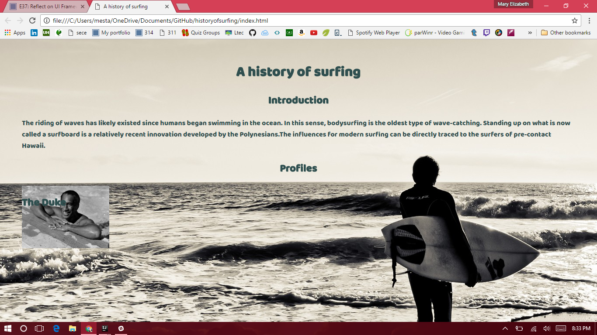
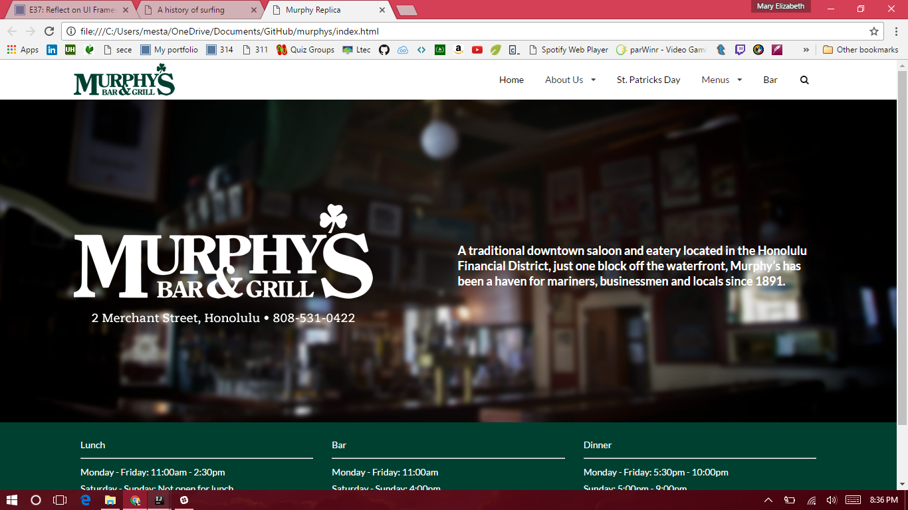

# How do I make a website?

I will be completely honest, I had no website making abilities ten days ago(except for this portfolio but I just followed a template). If I did make a website it only would have had headers, paragraphs, links, lists and images. It will be a website but not one that makes your eyes widen with approval, oh no. The websites looked as old as I did (you can probably guess my age range since I am a college student). Using html and css made me think it was difficult to make a great looking website because css seemed pretty linear. These were all very simple mechanics that did not make up the definition of a modern day website. Then, came the wonderful world of semantic

# Now this is how to make a website!

Semantic ui is a framework that provides a library items that can be added to a website. So instead of creating each element of a website manually, we can just place each an element and build it to our own customization. Now using this takes some time getting used to, within the first few days you will be flipping back in forth through web pages to find the item you want to implement into your website. Then, you have to figure out how to implement it properly. Trust me, I am speaking from experience. So do what I didn't and take some time to learn where everything is and how they work or else you will be wasting your time.

  
  

Once you get the hang of semantic ui, you can easily create the website you have envisioned. Take a look at the images above, these are both websites that I have created. The one on the left is a unfinished website created without semantic ui and the right one was created with semantic ui. Obviously the right one is significantly professional looking and it was done within half of the time to create the left website. Yes, it is possible to create a website of great profession using only css but the fact that a beginner like me was able to pick up semantic and create a website like the right says a lot about the framework.

# We did it!... So what?

Time and effort are not expendable resources in a project environment. I recommend you use semantic ui when creating websites because it will not burn these resources through. Time is our most valuable resource, once it passes there is no way of getting it back. Time impacts your project, and that impacts your success! Semantic ui is the way to success! Maybe I am being over dramatic but you get my point right? Semantic ui is the right way to create web applications.

